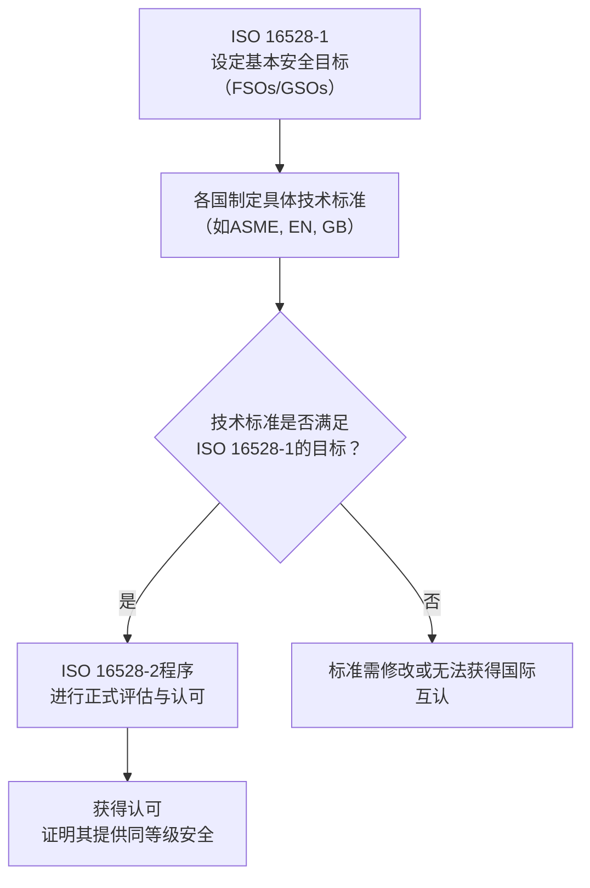

Boilers and pressure vessels

国际标准化组织（ISO）发布的​​顶层框架性标准​​，旨在全球范围内​​协调和认可​​各国家/地区的锅炉与压力容器标准。非强制性​​。它不直接用于锅炉或压力容器的设计制造，而是为各国监管机构（RAs）提供认可依据。

ISO 16528 定义了确保锅炉和压力容器安全性的​​12项基本安全目标（Fundamental Safety Objectives, FSOs）​​ 和​​13项全局安全目标（Global Safety Objectives, GSOs）​​。它不指定具体的技术路径（​​“如何做”​​），而是设定必须达到的安全目标（​​“做什么”​​）。

# 分册内容

ISO 16528-1 Part 1: Performance requirements
ISO 16528-2 Part 2: Procedures for fulfilling the requirements of ISO 16528-1

# 使用流程

# 对应/相关国际标准

ISO 16528 并不与任何国家的具体技术标准直接竞争或等效，而是位于它们之上。

美标体系
[[ASME BPVC]]

欧标体系
[[EN 12952]] Water-tube boilers and auxiliary installations
[[EN 13445]]

澳新标准
[[AS NZS 1228]]

中国标准
[[GBT 16508]]
[[GBT 150]]
[[TSG 11]] 锅炉
[[TSG 21]] 压力容器

